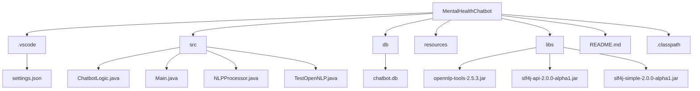

# Mental Health Chatbot

### Project Overview

A chatbot application aimed at providing mental health support by offering motivational quotes, stress-relief techniques, and a conversational interface.

### Day 1 Progress

- Defined key features of the chatbot:
  - Chat interface for user interaction.
  - Basic NLP for detecting user intent.
  - Predefined responses for mental health topics.
- Planned the user flow and folder structure.
- Set up the project directory.
- Decided on the tech stack:
  - **Backend**: Java
  - **Frontend**: JavaFX or Swing
  - **NLP**: Apache OpenNLP
  - **Database**: SQLite/MySQL

### Folder Structure

### Next Steps

- Set up the development environment.
- Build the project skeleton.

### Day 2 Progress
